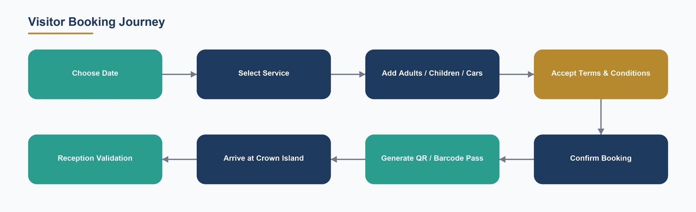
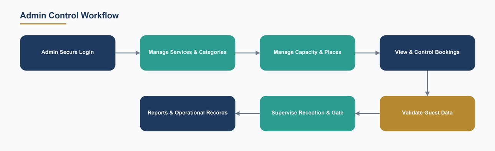
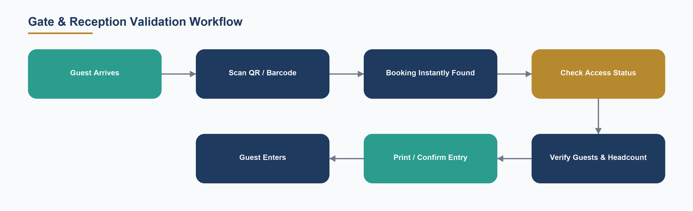
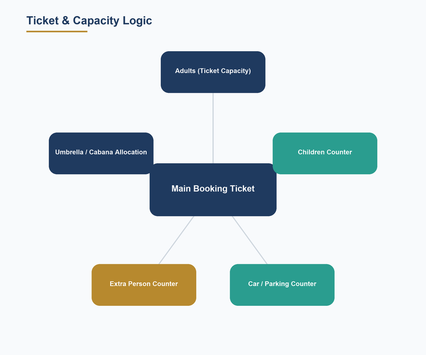
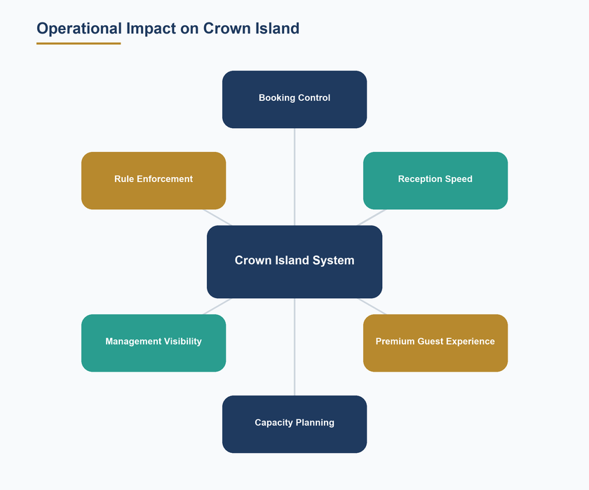
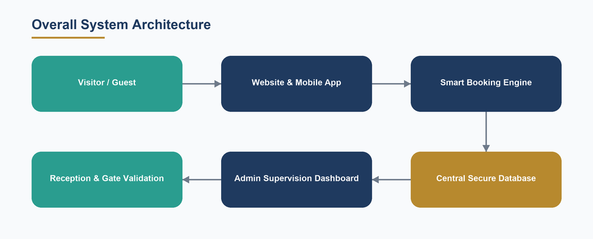

# Crown Island Smart Booking & Access Management System

## Operational Project Description & Scope Quotation

### Without Commercial Values

_Prepared for Crown Island Management — Confidential Project Proposal. This document contains no commercial or monetary values._

---

## Table of Contents

- 1  Executive Summary
- 2  Project Vision
- 3  Why This System Matters for Crown Island
- 4  Main System Modules
- 5  User Booking Journey
- 6  Admin Control Workflow
- 7  Reception & Gate Validation Workflow
- 8  Ticket & Capacity Logic
- 9  QR / Barcode Structure
- 10  Extra Person & Additional Guest Logic
- 11  Cabana / Umbrella Allocation Logic
- 12  Children, Adults, Cars & ID Handling
- 13  Terms, Conditions, Sanctions & Blocked Users
- 14  Invoice & Booking Summary Experience
- 15  Mobile App & API Readiness
- 16  How the System Affects Crown Island Operations
- 17  Security, Control & Data Accuracy
- 18  Scalability & Future Expansion
- 19  Project Deliverables
- 20  Closing Statement
- 21  Visual Workflow Blueprint

---

## 1  Executive Summary

Crown Island Smart Booking & Access Management System is a complete digital operating layer for the entire visitor lifecycle — from the moment a guest chooses a date online, through arrival, gate validation and beach access, all the way to centralized management supervision. It replaces scattered manual handling, paper lists and verbal coordination with one structured, bilingual (Arabic / English) platform that unifies online reservation, walk-in reception, QR gate validation, capacity control, physical cabin access and administrative oversight.

The result is smart operational control: faster guest entry, a clear reservation structure, reduced manual mistakes, better crowd management, a stronger reception workflow and centralized admin supervision — all delivered through a premium, app-like guest experience. This document describes the system, its full feature structure, its end-to-end workflow and, above all, how it improves Crown Island operationally. It intentionally contains no commercial or monetary values.

## 2  Project Vision

The vision is a single source of truth for every visit. Every umbrella, cabana, car, adult, child and extra guest is accounted for before the visitor reaches the gate — so the resort always knows exactly who is coming, when, and what capacity is committed. Reservation happens digitally and in advance; reception simply validates and admits; management sees everything in real time.

Crown Island moves from reactive, manual guest handling to proactive, structured digital control. The platform is designed as premium infrastructure: confident for guests, effortless for staff, and transparent for management — scalable enough to absorb peak-season demand without losing organization or the sense of a high-end destination.

## 3  Why This System Matters for Crown Island

A busy beach destination lives or dies on flow. Peak days bring crowds, families, cars and cabana demand all at once. Handled manually, that means queues at reception, guesswork on capacity, disputes over rules, and no single view of the day. This system directly removes those friction points.

- It organizes the booking before arrival, so reception pressure drops sharply on busy days.
- It gives the gate a scannable, structured access reference — entry becomes seconds, not minutes.
- It tracks real guest load (adults, children, cars, extra persons) so beach and cabana capacity is planned, not improvised.
- It enforces terms and access rules consistently, protecting both the guest experience and the resort.
- It puts every booking, guest and operational signal on one supervision dashboard for confident management decisions.

## 4  Main System Modules

The platform is built from clearly separated, cooperating modules. Each owns one part of the operation, and together they form one continuous digital chain from online booking to gate admission and back-office control.

| Module | Description | Operational Value |
| --- | --- | --- |
| Smart Booking Engine | Structured online reservation for beaches, cabanas, umbrellas, events and activities with live availability and capacity checks. | Books guests before arrival; prevents overselling; removes reception guesswork. |
| Guest Accounts & Access Gates | Secure registration, profile completion, and first-entry acceptance of Terms and Refund Policy before booking unlocks. | Every guest is known, verified and rule-aware before they arrive. |
| Reception Desk Console | A guided walk-in booking wizard with identity capture, returning-guest prefill, and on-site payment-method recording. | Turns the busiest counter into a fast, consistent, error-resistant workflow. |
| Gate Validation & QR Scanning | Fast QR / barcode scanning that finds the booking, verifies guests and admits by headcount on the correct day. | Seconds-fast entry, fewer mistakes, controlled access. |
| Capacity & Place Management | Per-service daily capacity plus a visual inventory of cabins, cabanas and umbrellas with adjacency and outage handling. | Beach space is planned and protected; the resort is never over-committed. |
| Admin Supervision Dashboard | Centralized control of bookings, guests, services, capacity, rules, staff and reports. | One command center; confident, data-driven management. |
| Physical Cabin Access | Optional integration that provisions cabin-door access and dynamic door passes for eligible bookings. | Premium, secure, self-unlock experience for cabin guests. |
| Guest Control & CRM | Customer 360 profiles, tags/segments, notes and history across visits. | Personal, professional guest handling and loyalty insight. |
| Rules, Sanctions & Blocklist | Terms enforcement, penalties, and an identity blocklist for banned guests. | Consistent rule enforcement and a safer environment. |
| Notifications & Reminders | In-app inbox plus browser push for confirmations, reminders and announcements. | Guests stay informed; the resort communicates on one channel. |
| Reporting & Audit Trail | Operational reports plus a complete, append-only record of sensitive actions. | Accountability, transparency and better decisions. |
| Mobile-Ready API Layer | A prepared interface for a companion mobile app to reuse the same booking engine. | A unified experience across web, mobile, reception and admin. |

## 5  User Booking Journey

The guest experience is a guided, confidence-building path. Each step is simple, each choice is validated live, and the outcome is a scannable access pass in the guest’s pocket before they ever leave home.

*Diagram 2 — Visitor booking journey*

| Step | User Action | System Response | Benefit |
| --- | --- | --- | --- |
| 1 | Choose a date | Confirms availability for that day | No wasted effort on full days |
| 2 | Select a service (beach, cabana, activity) | Loads the right service options and capacity rules | Clear, correct options every time |
| 3 | Add adults, children and cars | Calculates units and capacity live | Accurate guest load from the start |
| 4 | Accept Terms & Conditions | Records acceptance | Rule-aware guests, fewer disputes |
| 5 | Confirm the booking | Reserves capacity transactionally | No double-booking, no confusion |
| 6 | Receive a QR / barcode pass | Generates a signed daily access pass | Fast, contactless entry |
| 7 | Arrive and present the pass | Reception / gate scans and validates | Seconds-fast admission |

## 6  Admin Control Workflow

Management operates from a single, centralized dashboard. Every lever that shapes the day — services, capacity, rules, bookings, reception and staff — is controlled and monitored from one place, with a full audit trail behind every action.

*Diagram 3 — Admin control workflow*

| Capability | Purpose | Impact on Crown Island |
| --- | --- | --- |
| Manage categories & services | Define what can be booked and how it behaves | Flexible, expandable offering |
| Manage capacity & places | Set daily limits and organize cabins/cabanas/umbrellas | Protected, well-planned beach space |
| Oversee all bookings | View, edit, assign places, cancel or refund | Total control over the day |
| Control guest data & CRM | Profiles, tags, notes and history | Personal, professional service |
| Enforce rules & sanctions | Terms, penalties and blocked guests | Consistent, safer operations |
| Supervise reception & gate | Monitor desk and entry activity per operator | Accountability and speed |
| Broadcast notifications | Reach guests with reminders and announcements | Stronger communication |
| Read reports & audit logs | Occupancy, activity and staff performance insight | Confident, data-driven decisions |

## 7  Reception & Gate Validation Workflow

At the physical point of entry, the system gives staff a clear, repeatable workflow. A single scan resolves the whole visit, verifies the guests, and confirms admission on the correct day — replacing manual searching and paper checks with a fast, guided sequence.

*Diagram 4 — Gate & reception validation workflow*

| Stage | Staff Action | System Support | Result |
| --- | --- | --- | --- |
| Arrival | Greet the guest | Ready scanner on mobile or kiosk | Calm, organized entry |
| Scan | Scan the QR / barcode | Instantly resolves the booking | No manual lookup |
| Verify | Confirm guests present | Shows headcount, adults, children, cars | Right guests, right count |
| Check status | Confirm the pass is valid today | Enforces correct-day admission | No expired or wrong-day entry |
| Admit | Confirm / print entry details | Records the admission and place | Clean, auditable check-in |
| Exit | Scan on the way out (optional) | Records checkout | Accurate live occupancy |

## 8  Ticket & Capacity Logic

The ticket is the operational heart of the system. Rather than a single blurred count, the platform separates the ticket into clear, purpose-built counters — so the resort always understands the true composition of every booking and can manage beach capacity precisely.

*Diagram 5 — Ticket & capacity logic*

- Main ticket — carries a defined adult capacity that drives how many units (umbrellas / cabanas) a booking needs.
- Children counter — counted and displayed separately, with age and per-service rules, without inflating the main ticket capacity.
- Car / parking counter — tracked on its own so entrance and parking flow can be planned.
- Extra person counter — a separate operational counter for additional guests, never mixed randomly into the main ticket.
- Umbrella / cabana allocation — derived from the booking’s adult-driven capacity so space is organized automatically.

## 9  QR / Barcode Structure

Every reservation produces a scannable access reference designed for speed and control. The system uses a structured daily-access logic: a guest’s bookings for a given day are connected under one main daily access reference, so a single scan can resolve the guest’s entire day rather than forcing multiple separate checks.

- One signed daily pass groups all of a guest’s same-day bookings for a single, fast scan.
- The pass is valid for the correct resort day, preventing wrong-day or expired entry.
- Reception can additionally issue printed guest passes / wristband barcodes for physical control on the beach.
- The scan is contactless and instant — less manual checking, fewer mistakes, better guest control.

## 10  Extra Person & Additional Guest Logic

Additional guests are handled as a distinct operational counter, not blended into the main ticket. This gives the administration the real guest load at a glance and keeps beach capacity honest. Extra persons are counted at the gate and are subject to the same identity checks as other adult guests, so the headcount admitted always matches the headcount booked.

- Extra persons never silently inflate umbrella / cabana units or the core capacity model.
- Each extra person is visible, counted and controlled at entry.
- Management sees the true number of people on site — essential for crowd and capacity control.

## 11  Cabana / Umbrella Allocation Logic

The system organizes how many umbrellas or cabanas a booking requires based on its adult-driven capacity and booked units. Allocation is calculated consistently, so the beach is laid out by design rather than negotiated at the desk.

- Better space planning — the required units are known before the guest arrives.
- Better beach organization — parties are kept together with adjacency-aware place assignment.
- Less conflict at reception — allocation is rule-based, not improvised.
- Better visitor satisfaction — guests find organized, ready space that matches their booking.

## 12  Children, Adults, Cars & ID Handling

Adults, children and cars affect operations differently, so the system treats each as its own dimension — giving the resort precise, professional control over entry and space.

- Adults — drive ticket capacity and unit allocation; adult guests can be linked to identification details when a controlled entry record is required.
- Children — shown clearly in the booking for family planning and visibility, without unnecessary ID complexity, keeping the experience easy for families.
- Cars — counted for parking and entrance control so vehicle flow is planned.
- Identity records — adult ID / passport capture supports a professional, controlled admission record where the resort needs it.

## 13  Terms, Conditions, Sanctions & Blocked Users

The platform enforces the resort’s rules consistently and automatically. Guests accept the Terms & Conditions and Refund Policy as first-entry gates, and category-specific terms where applicable, so everyone arrives rule-aware — which reduces disputes and strengthens the resort’s operational protection.

- First-entry acceptance gates for Terms & Conditions and the Refund Policy, re-confirmed whenever the rules change.
- Per-category terms for services that carry their own conditions.
- A sanctions / penalties capability to record and settle rule breaches through the booking flow.
- An identity blocklist that stops banned guests from re-entering under any identifier — enforced at registration, reception and the gate for a safer environment.

## 14  Invoice & Booking Summary Experience

Every booking produces a clear, structured record — a professional booking summary that documents the reservation, its guests, its counters, its access status and its reception details. Reception can produce a printable booking / invoice-style document for the guest, and management retains a full, accountable record of every reservation. (This document is intentionally free of monetary values; the summary focuses here on clarity, accountability and professional documentation.)

## 15  Mobile App & API Readiness

The guest experience is delivered as an installable, app-like Progressive Web App, and the platform exposes a dedicated, prepared interface (API layer) for a companion mobile application to reuse the very same booking engine, rules and capacity model. This means the resort can extend to a native mobile experience without rebuilding the core — creating one unified digital experience across web, mobile, reception and admin.

> Planned / expandable module: a dedicated React Native companion app is API-ready and can be activated to bring the full booking, pass and notification experience to native iOS and Android.

## 16  How the System Affects Crown Island Operations

This is where the platform proves its value. Beyond digitizing bookings, it changes how the destination runs on the ground — measurably faster, calmer and more organized, especially under peak-season load.

*Diagram 6 — Operational impact*

- Faster entry at the gate — a single scan replaces manual searching.
- Less pressure on reception staff — most of the work happens before arrival.
- More organized guest flow — arrivals are structured, not chaotic.
- Clearer beach capacity planning — real adult / child / car / extra-person load is known in advance.
- Better cabana and umbrella distribution — allocation is rule-based and adjacency-aware.
- Reduced booking mistakes — validated, transactional reservations remove double-booking and confusion.
- Better family guest handling — children are visible and easy without ID friction.
- Stronger rule enforcement — terms, sanctions and the blocklist apply consistently.
- Improved management visibility — one dashboard shows the whole operation live.
- A more premium guest experience — confident, contactless, well-organized visits.
- Better decision-making — reports and audit trails turn activity into insight.
- A more scalable operation during high seasons — the platform absorbs demand without losing control.

| Area | Before the System | After the System | Impact |
| --- | --- | --- | --- |
| Guest entry | Manual lists, slow checks, queues | One scan, instant validation | Faster, calmer gate |
| Reception load | High pressure, repetitive data entry | Pre-booked, guided wizard | Less stress, fewer errors |
| Capacity control | Guesswork, risk of overselling | Live, rule-based capacity | No over-commitment |
| Beach organization | Improvised umbrella/cabana placing | Automatic, adjacency-aware allocation | Organized, ready space |
| Rule enforcement | Inconsistent, dispute-prone | Automatic terms, sanctions, blocklist | Consistent and protected |
| Management view | Fragmented, after-the-fact | One live supervision dashboard | Confident decisions |
| Guest experience | Manual and uncertain | Digital, contactless, premium | Higher satisfaction & loyalty |
| Peak-season scale | Bottlenecks and confusion | Structured digital flow | Scales without losing control |

## 17  Security, Control & Data Accuracy

The platform is built for controlled, accurate operations. Access is role-based, sensitive actions are audited, and the booking, capacity and guest data stay consistent through validated, transactional processes.

- Role-based access — reception, gate, operations and administration each see only what they should.
- Complete audit trail — an append-only record of sensitive actions for accountability.
- Staff accountability — activity is attributable per operator, with shift tracking.
- Reduced human error — validation and structure replace manual, error-prone steps.
- Controlled access — correct-day, correct-headcount admission with identity checks where required.
- Cleaner operational records — one accurate source of truth, with secure backup and restore.

## 18  Scalability & Future Expansion

The system is a scalable digital infrastructure. Because services, categories, capacity and rules are all administrator-managed, Crown Island can grow its offering and volume without re-engineering the platform.

- Flexible catalog — add new beaches, cabana types, events or activities from the admin side.
- Expandable modules — water-sports / activity booking and physical cabin-door access are prepared to extend the platform.
- Companion mobile app — API-ready for native iOS / Android (planned / expandable module).
- Guest engagement — notification campaigns and reminders scale communication with the audience.
- Multi-season readiness — the same infrastructure absorbs peak demand and quiet periods alike.

## 19  Project Deliverables

The project delivers a complete, cooperating set of components — a ready operational platform, not a collection of parts.

- Smart booking interface (bilingual, installable web app).
- Centralized admin supervision dashboard.
- Complete booking management system.
- Category and service management.
- Ticket and guest-counter logic (adults, children, cars, extra persons).
- QR / barcode generation with a signed daily access pass.
- Reception validation workflow with printable passes and booking summaries.
- Booking details and summary / invoice-style pages.
- Terms & Conditions and policy-gate integration.
- Sanctions / blocked-guest control.
- Capacity and place (cabana / umbrella) management with adjacency and outages.
- Notifications and reminders (in-app inbox + browser push).
- Reporting and a complete audit trail.
- API-ready structure and mobile-app integration readiness.
- Operational documentation.
- Scalable, future-ready modules (activities, physical cabin access, companion app).

## 20  Closing Statement

Crown Island Smart Booking & Access Management System is not just a booking tool. It is a complete operational layer that transforms Crown Island from manual guest handling into a controlled, scalable and premium digital visitor experience.

It books guests before they arrive, admits them in seconds, plans the beach with precision, enforces the resort’s rules automatically, and gives management a single, confident view of the entire operation. It is smart operational control — delivered as premium infrastructure, ready today and built to scale with Crown Island’s ambitions.

## 21  Visual Workflow Blueprint

The overall architecture below shows how every module connects into one continuous digital chain — from the guest, through the booking engine and secure database, to management supervision and on-the-ground reception and gate validation.

*Diagram 1 — Overall system architecture*

Diagram index: (1) Overall System Architecture — this section; (2) Visitor Booking Journey — Section 5; (3) Admin Control Workflow — Section 6; (4) Gate & Reception Validation — Section 7; (5) Ticket & Capacity Logic — Section 8; (6) Operational Impact — Section 16.

